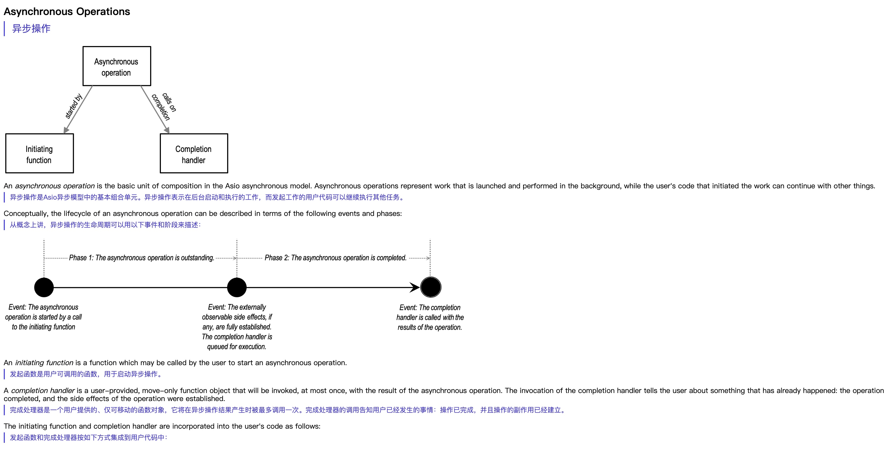

最近用 AI 写了很多项目，但其中大多数都是玩具项目，完成之后，我自己在日常生活中也很少真正使用它们。
今天阅读英文文章时，我想找一个网页翻译插件：它能够借助大模型将英文翻译成中文，并提供原文与译文的对照。
这类插件确实存在，但很多都需要付费，而且提供了不少我并不需要的功能。于是我突发奇想，决定用 Codex 快速实现一个 Chrome 插件，满足自己简单的网页翻译需求。

项目代码我放在了 GitHub 上，欢迎审阅、使用并提出意见：[web-translate](https://github.com/xuetianhao98/web-translate)

## 效果

上图中的蓝色中文内容由翻译插件生成，并与英文原文一一对应。翻译使用的是 DeepSeek-v4-flash 模型，并关闭了思考模式，主要是为了提高翻译速度。

## AI 编程实践经验

这个项目是我用 Codex 快速开发的。在此之前，我对前端技术栈知之甚少，也没有任何 Chrome 插件开发经验。
因此，我认为这次 AI 编程的过程值得记录。我也希望逐渐完善自己的 AI 编程工作流，从而更加高效地利用 AI 做更多事情。

### 工作前的准备

在正式让 AI 开始写代码之前，我先让它做了一件事：结合项目的实际情况，搜索并安装一些实用的 Skill 和插件。
这些前期准备能够让后续开发更加顺利。以这个项目为例，Codex 搜索后告诉我，Google 最近提供了一个用于开发浏览器扩展的官方 Skill：[chrome-extensions](https://github.com/GoogleChrome/modern-web-guidance-src/tree/main/skills-src/chrome-extensions)，并帮我将它安装到了项目中。

有了这个 Skill 之后，我又让 AI 检查本地开发环境，确认是否缺少必要的开发工具，并在需要时帮助我安装。Codex 根据 Skill 中的说明检查了我的开发环境，随后安装了所需的框架和工具。

完成这些准备工作后，我才开始正式开发。

### 设定最简单的目标

C++ 是我的编程母语。当我让 AI 编写 C++ 代码时，通常会深度参与项目的整个流程，包括架构设计、代码细节、测试和性能优化。但对于浏览器插件开发，我几乎一窍不通，因此采用了一种既乐观又谨慎的工作方式：

- 乐观：相信当前 Agent 的能力。它们已经能够很好地完成一些中等复杂度的工作，甚至可能比大多数人做得更好，因此我不需要掌控过多细节。
- 谨慎：大型或复杂项目不可能一蹴而就。尤其是在自己完全不了解的领域，如果让 AI 自由发挥，项目很容易烂尾，而自己又缺乏足够的能力进行验收。因此，第一个版本只需要实现一个非常简单的核心功能。

基于这一思路，我严格限制了项目的实现路径和目标，要求它用最简单的方式实现最核心的功能：只接入 DeepSeek，不考虑多模型适配；只提供基础翻译，不增加其他功能，以避免代码过早膨胀。
最终效果非常不错。Codex 实现的第一个版本已经完全满足了我的需求，甚至不需要进行任何修改。当然，它也列出了一系列后续建议，并提醒我，这个项目目前仍处于雏形阶段，可能还无法上架 Chrome 应用商店，也不适合直接分发给其他人。不过对我而言，这已经足够了。

### 完成之后该做什么

一个由 AI 完成的项目能否不断发展，最终成长为成熟的产品，我认为关键在于开发者能否真正理解并掌控它。
因此，在项目完成后，应该主动去理解代码中的关键部分，学习自己不熟悉的知识，并持续优化和改进项目。
最重要的是，应该真正、持续地使用这个项目，而不是完成后就将它丢在一边，等下次有类似需求时，再让 AI 快速生成一个功能相近的新项目，那样纯粹是浪费时间和 token。
